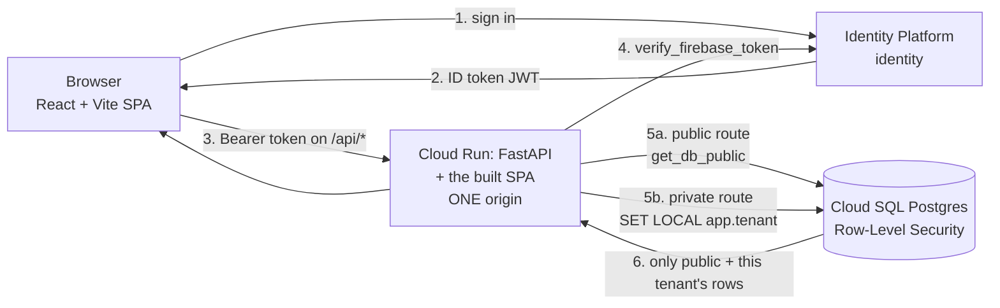

# Architecture — School Improvement Platform

A multi-tenant data platform for California school-improvement analysis. **Public** state
data (attendance, behavior, academics, …) is shared across everyone; a **district's own**
data (its improvement plans, and later its private metrics) is isolated by PostgreSQL
row-level security. This document is the map: how the pieces fit, where they live in the
repo, and what's left to build.

**Stack:** Cloud SQL (Postgres) · Cloud Run (FastAPI) · Cloud Storage + Claude for raw-data /
plan ingest — *live*. **Planned:** a React + Vite + TypeScript SPA **served by FastAPI from
the same Cloud Run service** *(the demo serves a no-build React UI from the app itself)* ·
**Identity Platform** sign-in *(the demo is gated by Cloud Run IAM)*. Naming decoder, because Google's console will not say any of the older names: the product is **Identity Platform** (formerly "Google Cloud Identity Platform"/GCIP — that acronym appears nowhere in the console), its console URL slug is `customer-identity`, its API is `identitytoolkit.googleapis.com`, and it issues **Firebase** ID tokens. Four names, one thing · the
domain via **Cloud Run domain mapping**, with DNS on **Google-hosted nameservers** (managed
via the Squarespace panel).

**Not used — deliberately:** third-party static hosting, edge proxies/WAFs, edge workers, and
tunnels. An earlier plan put the frontend on a separate static host; serving the built SPA from
FastAPI keeps **one origin**, which is
why this codebase has no CORS middleware and needs none. Choosing Identity Platform for identity
removed the last job an edge provider had. The cutover plan: [`docs/GO_LIVE_PLAN.md`](docs/GO_LIVE_PLAN.md).

**Guiding principle:** this is a *prototype*. Build the isolation seam (`tenant_id` + RLS)
correctly now because it's expensive to retrofit; keep everything else simple and upgrade
later.

**One origin is an invariant, not a convenience.** The SPA calls relative paths (`/api/...`)
only; dev uses Vite's `server.proxy`. If `CORSMiddleware` ever appears in this app, the
invariant has been broken — that's a design smell to raise, not a fix to apply.

---

## 1. How a request flows (the trust boundary)

The whole security model hinges on one seam: **the tenant is derived from a verified
identity server-side, never sent by the client.** Postgres then enforces it.

### Two questions, not one

"Auth" is really two mechanisms with different jobs and different urgency. Keeping them
distinct is what lets this service go on the internet without the tenancy work being finished:

| Question | Mechanism | Load-bearing today? |
|---|---|---|
| **Who are you?** (authentication) | Identity Platform verifies the ID token | **Yes** — it's the only thing that makes public exposure safe |
| **What may you see?** (tenancy) | `tenant_id` claim → `SET LOCAL app.tenant` → RLS | **No** — every row served today is public |

Everything the app currently serves (`/marts/*`, `/chat`, `/schools`) reads `get_db_public`.
So authentication gates the service; **tenancy is built, proven, and dormant** until private
district data lands. Consequently there are two dependencies, and using the wrong one is a
bug in both directions:

- `get_current_principal` — verify the token, return claims, **require no tenant**. Public
  `/api` routes use this. (Gating public data on `get_current_tenant` would 403 every signed-in
  user who isn't district staff.)
- `get_current_tenant` — verify, then map claims → `tenant_id`, 403 if unmapped. Guards
  `/api/plans/*` and every future private route.

> **Planned (production auth).** This Identity Platform flow is the *target*. The **deployed demo uses
> Cloud Run IAM** for access and reads only public marts, so the `SET LOCAL app.tenant` leg
> below isn't exercised yet.



The browser is served the SPA by the same Cloud Run service it calls — there is no second
host and no cross-origin hop, so no CORS and no third-party-cookie exposure.

> ⚠️ **`DEV_MODE` is a production-grade hazard once the IAM gate is removed.**
> [`security.py`](backend/app/security.py) trusts an `X-Dev-Tenant` header when `dev_mode` is
> on — that is tenant impersonation by request header. It is harmless behind IAM and
> unacceptable on the open internet. `DEV_MODE=false` in a deploy flag is *not* sufficient;
> the app must structurally refuse the dev path when a production signal (`K_SERVICE`,
> `INSTANCE_CONNECTION_NAME`) is present.

1. The user signs in through **Identity Platform** — email/password, the district's SSO (SAML/OIDC), or
   a social provider. **No Gmail required**; Identity Platform is a customer-identity service.
2. Identity Platform returns a signed **ID token** (a Firebase/Identity-Platform JWT).
3. The browser calls the API with `Authorization: Bearer <token>`.
4. [`app/security.py`](backend/app/security.py) **verifies** the token — signature, issuer
   (`securetoken.google.com/<project>`), audience (the project id), expiry — using
   `google-auth`'s `verify_firebase_token`. Then it maps the verified identity to a
   `tenant_id` (a **custom claim** on the user, or an email-domain fallback).
5. [`app/db.py`](backend/app/db.py) opens a session and runs `SET LOCAL app.tenant = <tenant>`.
6. The **RLS policies** ([migration 0001](backend/migrations/versions/0001_initial_schema.py))
   scope every private table to `tenant_id = current_setting('app.tenant')`. The app connects
   as `sip_app` — a **non-owner, NOBYPASSRLS** role — so the database enforces isolation even
   if application code has a bug.

That is the only real glue in the stack. Everything else is conventional.

## 2. The data model (five layers)

Full spec: [`docs/TARGET_SCHEMA.md`](docs/TARGET_SCHEMA.md). Generated table reference:
[`backend/SCHEMA_REFERENCE.md`](backend/SCHEMA_REFERENCE.md). The model is dimensional (a
star schema) organised as five conceptual layers:

| Layer | What it holds | Where |
|---|---|---|
| **raw** | Source files as pulled from CDE / data.ca.gov | Cloud Storage (`gs://…/raw/ca/…`), not in repo |
| **staging** | The reviewable shape between "what a loader read" and "what the DB believes" | e.g. the SIP `ExtractedPlan` JSON ([schema.py](backend/etl/ca/sip/schema.py)) |
| **star** | Conformed facts + dimensions — the keystone `fact_metric` (grain: school × period × metric × student-group) plus `dim_*` | [`app/models/`](backend/app/models/) — **core**, 14 tables (incl. tenancy) |
| **augment** | Plans and other tenant entities that *reference* the star (`plan` / `plan_goal` / `plan_action`, `plan_extraction`) | [`etl/ca/sip/models.py`](backend/etl/ca/sip/models.py) — **sip**'s, moved out of core 2026-07-15 (§4) |
| **marts** | Semantic read models for the dashboard: attendance need-vs-plan diagnostic + "schools like you" peer comparison | [`app/marts.py`](backend/app/marts.py) — endpoint-composed (MVP), reads public `plan_extraction` + `fact_metric` + peer tables |

**Identity** keys on the federal **NCES** id; the California **CDS** code rides alongside as
`state_school_id` / `state_district_id`. A CDS→NCES crosswalk runs in every loader, with a
`CA-<cds>` fallback for schools without an NCES id yet.

## 3. Two ingest pipelines

**A. Public metrics (bulk ETL).** Per-fact loaders read CDE files and write `fact_metric`
rows at `tenant_id='public'`. Thin scripts over shared machinery — see
[`backend/public_metrics/`](backend/public_metrics/) and [its README](backend/public_metrics/README.md). Run in
Cloud Shell against Cloud SQL via the Auth Proxy.

**B. School improvement plans (PDF → review → DB).** The one that turns a district's SPSA/
LCAP PDF into structured, private, tenant-scoped data:

> **Planned (private-tenant path).** The `/plans/extract → review → /plans/load` flow below
> writes private, RLS-scoped `plan_*` tables and is the *target*. The **demo instead runs a
> batch public path** — `batch_extract → GCS JSON → load_plan_extractions → public
> plan_extraction` — which is what the marts and the diagnostic UI actually read today.

```
PDF ──▶ POST /plans/extract ──▶ ExtractedPlan JSON ──▶ human review ──▶ POST /plans/load ──▶ plan_* tables
        (Claude reads the PDF,   (goals, actions,        (confirm the      (writes only under
         schema.py contract)      metric-link proposals,  proposed metric    the caller's tenant,
                                  page-level provenance)   mappings)          RLS-enforced)
```

- Extractor core: [`backend/etl/ca/sip/extract_sip.py`](backend/etl/ca/sip/extract_sip.py)
  (Claude Opus 4.8 reads the PDF natively; Python stamps deterministic ids + source hash).
- API surface: [`backend/app/plans.py`](backend/app/plans.py) — `extract` (returns the review
  JSON, writes nothing) and `load` (approved JSON → DB).
- Loader: [`backend/app/plan_loader.py`](backend/app/plan_loader.py) — only *confirmed*
  metric links are written; idempotent via deterministic ids.

## 4. Modules (how the code is cut)

The other seam. §1 isolates **tenants** so one district's data can't reach another's. This
isolates **features**, so one part can be rewritten without breaking the rest — the same move
on a different axis, and the same reason: cheap to build in, expensive to retrofit.

**The seam is a database table.** A module that produces a table owns it; everyone else reads
that table with SQL. No module imports another module. That is what makes a module swappable:
rewrite the matching engine however you like, keep `mart_school_peer`'s column shape, and
nothing downstream notices. A Python import would couple the two forever; a table doesn't.

**The cut is producer/consumer, not feature:**

| | Declares (whose model/migration) | Writes (rows) | Serves |
|---|---|---|---|
| **core** | the star schema, tenancy, the conformed vocab, `db`/`security`/`config` | — | — |
| **public_metrics** | — | `fact_metric`, and the `dim_*` rows | (bulk ETL) |
| **sip** | `plan_extraction`, `plan_*` | the same | `POST /plans/*` (ingest) |
| **likeschools** | `mart_school_peer`, `feat_match_vector`, `model_partition_stats` | the same | — *engine only* |
| **serving** | — | — | `/marts/*`, `/chat` |

Two different ownerships, and they come apart on the shared tables: `core` **declares**
`dim_school` and `fact_metric` (their shape is the contract) but **writes** nothing — the rows
come from public_metrics, seeded from core's vocabulary. Everywhere else the two coincide: a
module declares its own tables and is the only thing that writes them. The seam is the table
either way; "producer" means whoever puts rows in it.

Modules depend on `core`; `core` never depends on a module. That direction is the whole point —
`core` is the frozen contract, so a module's own table living inside it made every feature change
a breaking change to the thing everything depends on.

The frontend is outside this: it's a separate build artifact in the same container (§5), not a
module, and it reaches the backend over HTTP like any other client.

**Why not cut by feature?** It was tried, and the code refuses. Giving `likeschools` its own
peer endpoints means `serving`'s attendance diagnostic and school-detail panel — both of which
need `fetch_peer_benchmark` — have to import it. That's a cross-module import, i.e. the rule
gone on day one, and the alternative (a second copy of the percentile logic) is worse. Cutting
producer/consumer keeps the table as the only seam. The cost: `likeschools` is not a vertical
slice, and the peer endpoints live in `serving`. Accepted deliberately (2026-07-15).

**Enforced, not aspirational.** [`backend/tests/test_module_boundaries.py`](backend/tests/test_module_boundaries.py)
walks the AST of every import and fails CI on the first one that crosses a module line, so this
section can't quietly become fiction. `app/main.py` is the composition root — wiring, not a
module, and the one exempt file. It must stay thin: logic that lands there has escaped the rule.

> **The idea lives here; the inventory lives in [`docs/MODULES.md`](docs/MODULES.md)** — who owns
> what, where each component currently sits, and reorg status. This section changes rarely; that
> registry changes on every relocation. Rules for working inside a module: [`CLAUDE.md`](CLAUDE.md).

---

## 5. Deployment

Container + Cloud Run steps: [`backend/DEPLOY.md`](backend/DEPLOY.md). The API uses the Cloud
SQL Python Connector when `INSTANCE_CONNECTION_NAME` is set (no Auth-Proxy sidecar on Cloud
Run), else the proxy URL locally. Secrets (`sip-app-password`, `sip-migrator-password`,
`anthropic-api-key`) come from Secret Manager via ADC — never the repo.

**One service, one image, one deploy target.** A multi-stage Dockerfile builds the SPA
(node → `vite build` → `frontend/dist`) and copies it into the Python stage, which serves both
the API and the SPA. There is no second deploy target and no separate frontend host.

**Build path (byproduct to know about):** `gcloud run deploy --source .` zips the **repo root**
into the auto-created **`run-sources-<project>-<region>` GCS bucket** → **Cloud Build** builds
the `Dockerfile` → pushes to **Artifact Registry** (`cloud-run-source-deploy`) → **Cloud Run**
runs the image. Those source zips are build inputs only (one per deploy); safe to prune.

> **The build context is the repo root, not `backend/`.** It moved because a multi-stage build
> that compiles `frontend/` cannot see it from a `backend/` context — this is why the deploy
> command is `--source .` and why `.gcloudignore` matters (`node_modules/`, `.git/`,
> `frontend/dist/`, `__pycache__/`). The `California/` raw data is a sibling *outside* this
> repo, so it is already out of context.

**Domain:** a **Cloud Run domain mapping** (`gcloud beta run domain-mappings` — the GA
`gcloud run domain-mappings` command is Anthos-only), with the CNAME to `ghs.googlehosted.com`
in **Google-hosted DNS** (nameservers managed via the Squarespace panel). `us-central1`
supports domain mappings (verified 2026-07-15). No load balancer, no tunnel, no proxy —
**the domain requires zero repo artifacts.** Google-hosted DNS has no proxying mode, so the
CNAME is always visible to Google's cert provisioning — the proxy-hides-the-CNAME failure
class is structurally absent here.

> **Accepted limitation — `*.run.app` stays reachable, and we do not fix it.** The custom
> domain is convenience, not a boundary: anyone with the `run.app` URL skips
> it entirely. **Identity Platform verification in FastAPI is the
> perimeter** — it doesn't care which hostname a request arrived on, which is the conventional
> Cloud Run pattern. Therefore: **no ALB, no ingress restrictions, no hostname-checking
> middleware, and no edge-dependent logic in the app.** Hardening is a deliberate infra
> change if we ever want it — never a scaffold feature.

> **Temporary demo, not prod.** What is currently deployed is the MVP demo described in
> [Status](#status): **IAM-gated** (not Identity Platform), a **self-served no-build React UI**, reading the
> **public `plan_extraction`** marts — deliberately *not* the Identity Platform + private-tenant `/plans`
> architecture this document specifies. It's for showing the diagnostic, and is expected to be
> replaced at the real prod cutover. [`docs/GO_LIVE_PLAN.md`](docs/GO_LIVE_PLAN.md) is the
> sequenced plan for that cutover.

---

## Document index

**Looking for where a feature's code lives? → [`docs/MODULES.md`](docs/MODULES.md).**

This section used to also carry a path-by-path map of the codebase, grouped by technical layer
(Backend / ETL). It was deleted rather than updated: it duplicated the module registry, and two
maps of one codebase drift — this one silently stopped mentioning `etl/peers/` (the entire
likeschools engine), `app/marts.py`, `app/chat.py`, and `backend/tests/`, while still describing
`main.py` as serving only `/health`, `/schools`, and the plans router. The registry is generated
from and reconciled against the code; a second copy here earns nothing and rots.

| Doc | What it is |
|---|---|
| [`README.md`](README.md) | One-paragraph overview + status |
| [`ARCHITECTURE.md`](ARCHITECTURE.md) | **This document** — how the pieces fit, and why |
| [`CLAUDE.md`](CLAUDE.md) | How to work in this repo — the module rule, `core` policy |
| [`docs/MODULES.md`](docs/MODULES.md) | **The module registry** — who owns what, where it lives, reorg status |
| [`docs/GO_LIVE_PLAN.md`](docs/GO_LIVE_PLAN.md) | **The internet-exposure cutover** — sequenced tasks, what's dropped, why the gate opens last |
| [`docs/TARGET_SCHEMA.md`](docs/TARGET_SCHEMA.md) | The data-model spec — five layers, tenancy + RLS, missingness, instruments |
| [`docs/DATA_CATALOG.md`](docs/DATA_CATALOG.md) | Raw CA data sources and how they were obtained |
| **Frontend** *(planned — see the go-live plan)* | |
| `frontend/` | React + Vite + TypeScript SPA. Built into the container; served by FastAPI at one origin. Calls `/api/*` via relative paths only |
| `Dockerfile` (repo root) | Multi-stage: node builds `frontend/dist` → python stage serves API + SPA |
| **Backend** | |
| [`backend/README.md`](backend/README.md) | Roles/bootstrap, migrations, RLS smoke test, running loaders |
| [`backend/DEPLOY.md`](backend/DEPLOY.md) | Cloud Run deploy: Dockerfile, Cloud SQL Connector, secrets |
| [`backend/SCHEMA_REFERENCE.md`](backend/SCHEMA_REFERENCE.md) | Generated table reference (from the models) |

Repo: **github.com/PrevaGroup/school-improvement** (branch `main`).

---

## Status

- **Live:** Cloud SQL Postgres, full aggregate **star schema (21 tables)** + **RLS** (tenant
  isolation proven), credentials in Secret Manager. **8 public metrics loaded** (~960k
  `fact_metric` rows). The **marts layer** ([`app/marts.py`](backend/app/marts.py)) and a
  **single-school attendance-diagnostic UI** — need-vs-plan, a "schools like you" peer engine,
  and a grounded chat — are **built and deployed to Cloud Run** (see the demo caveat below).
- **⚠️ The deployed Cloud Run service is a temporary demo, not the production architecture
  above.** It is gated by **Cloud Run IAM** (`run.invoker`) instead of Identity Platform sign-in; serves a
  **no-build React UI from the app itself** (no Vite); reads the **public `plan_extraction`**
  table via the batch `extract → GCS JSON → load_plan_extractions` path, **not** the private
  `/plans` tenant path; and runs at `--min-instances 0`. It exists to show the diagnostic, not
  to be the production cutover.
- **Not done:** Identity Platform sign-in + user provisioning, the private-tenant `/plans` serving path, and
  the real frontend (React + Vite + TypeScript in `frontend/`).
- **Next: go public.** [`docs/GO_LIVE_PLAN.md`](docs/GO_LIVE_PLAN.md) sequences the cutover from
  "IAM-gated, only Tim can open it" to "invited people sign in with Identity Platform at a real domain."
  Its load-bearing constraint: **the IAM gate opens last**, after the `DEV_MODE` lockout and
  the in-app Claude spend cap — because IAM is currently what provides both.

## Remaining architecture tasks

> **Go-live (making this reachable on the internet) is planned in detail in
> [`docs/GO_LIVE_PLAN.md`](docs/GO_LIVE_PLAN.md).** The auth / deploy / frontend items below
> are summarised from it; that document has the ordering and the reasoning.

**Auth / provisioning**
- [x] **Split authentication from tenancy** in `security.py` — `get_current_principal` (verify
      only, no tenant) alongside `get_current_tenant` (verify + map, 403 if unmapped). Public
      `/api` routes use the former. *(#8, merged 2026-07-15, ahead of the `core/` carve-out.)*
- [x] **`DEV_MODE` is structurally unreachable in prod** — the `X-Dev-Tenant` path is gated on
      the environment (`K_SERVICE` / `INSTANCE_CONNECTION_NAME`), not the flag, plus an
      import-time assert in `main.py`. *(#8.)*
- [ ] **Enable Identity Platform** — `identitytoolkit.googleapis.com` is **not enabled on the
      project** (checked 2026-07-15); Identity Platform does not exist yet. Then the Firebase JS SDK in the
      SPA (sign-in, token refresh, 401 → redirect) + the custom domain in Identity Platform **authorized
      domains**. **This is the critical path to letting anyone in** — it gates testers, not
      code, so start it first and run it in parallel with everything else.
- [ ] Stand up Identity Platform user provisioning — create users and set the `tenant_id` custom claim
      (`firebase-admin` / Identity Platform Admin API). Until then, use `DOMAIN_TENANT_MAP`.
      *(Public-data testers need **no** claim — that's the point of the split above.)*
- [ ] Seed `dim_tenant` with the real districts; create a second tenant for isolation testing.

**Deploy**
- [x] `gcloud run deploy` the backend; `anthropic-api-key` secret; runtime SA `secretAccessor`
      + `cloudsql.client`. *(Live 2026-07-14, IAM-gated.)*
- [ ] **Move Claude spend control into the app** — a per-principal daily cap on `/api/chat`
      keyed on the verified Identity Platform subject. The IAM gate is what caps spend today; opening the
      gate removes it, and there is no edge rate limiter to inherit.
      Prerequisite for opening the gate.
- [ ] Deploy Identity Platform-enforced but still `--no-allow-unauthenticated`; verify 401-without-token;
      **only then** `--allow-unauthenticated` + `--min-instances 1`.
      *(`gcloud beta` is installed as of 2026-07-15, so the domain mapping below is unblocked.)*
- [ ] Create the domain mapping; add the CNAME (`ghs.googlehosted.com`) in DNS via the
      Squarespace panel; verify domain ownership
      in Search Console first (hard prerequisite); allow hours for the cert.
- [ ] Re-run the tenant-isolation test end-to-end against the deployed API (log in as two
      districts, confirm neither sees the other's plans).

**SIP pipeline**
- [ ] Run the extractor against a real Long Beach SPSA and eyeball the JSON vs. `schema.py`.
- [ ] Add a `bridge_action_metric` + provenance table (migration) so the load is lossless
      (multi-metric goals, page-level provenance) instead of one-metric-per-goal.
- [ ] Review UI/endpoint to move metric links `proposed → confirmed` before load; orphan
      pruning on re-load.

**Data / marts**
- [ ] Build the benchmarking derive (state/district/peer, status×change bands) — deferred
      rollup rows go to `ref_benchmark`.
- [ ] Build the **marts** semantic layer the dashboard/agents read.

**Frontend**
- [x] Scaffold `frontend/` (React + Vite + TypeScript); ported the no-build UI verbatim — a
      port, not a redesign, so any regression stays attributable. Bundling also drops the
      runtime dependency on **esm.sh**, which the old page fetched React from on every load.
- [x] All API routes under `/api/*`; `frontend/dist` mounted + an SPA catch-all registered
      **last**, which returns a JSON 404 for unmatched `/api` rather than the HTML shell.
- [x] Multi-stage Dockerfile at the repo root; deploy is `--source .`; `.gcloudignore` +
      `.dockerignore` added.
- [ ] Vega-Lite chart contract + **deterministic validator** (reject remote `url` data,
      whitelist fields, cap 5k rows, reject-don't-repair) — its own module, not inside
      `chat.py`.

---

## Cost at MVP scale (rough, USD/mo)

Reflects the go-live target (`min-instances 1`, no edge compute).

| Item | Cost |
|---|---|
| Cloud SQL (small, single-zone) | ~$10–25 |
| Cloud Run (FastAPI + SPA, **min-instances = 1**, always warm) | ~$6–15 |
| DNS (Google-hosted nameservers, via Squarespace) | $0 |
| Cloud Run domain mapping | $0 |
| Identity Platform (under free-tier MAU) | ~$0 |
| Cloud Storage (raw data, Standard, first 5 GB free) | pennies–$2 |
| Claude API (chat + SIP extraction) | usage-based — **app-capped per user once the IAM gate opens** |
| **Total (excl. Claude usage)** | **~$20–45/mo** |

`min-instances 1` is the deliberate delta (was 0, ~$0–5): invited testers shouldn't meet a
cold start plus a Cloud SQL connect on first click — it reads as "broken", not "thrifty".

## FERPA & access-control decisions (carry forward)

- **Isolation is enforced in the database**: app connects as a non-owner, NOBYPASSRLS role +
  `FORCE ROW LEVEL SECURITY`, so a code bug can't leak across tenants. Every private row
  carries a consistent `tenant_id` and no query joins across tenants — this keeps the option
  to peel a tenant into its own schema/DB when a real FERPA contract lands.
- **Access control = RLS only, flat within a district.** Every authenticated member of a
  district sees all of that district's data — no per-user roles in the MVP.
- **Tenant granularity = the district.** No school- or student-level access structure yet.
- **ReBAC + finer granularity + FERPA arrive together.** District-level aggregates are
  generally not FERPA-covered PII; the moment data gets granular enough to be FERPA-sensitive
  is the same moment you'd add relationship-based access control. Treat them as one future
  milestone, not three.
