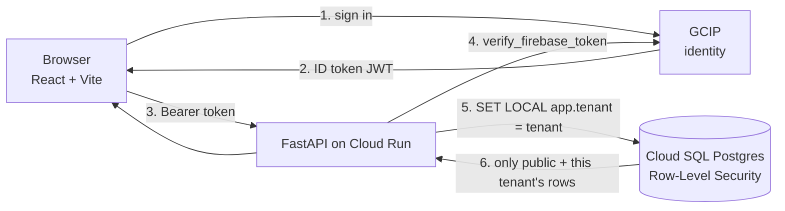

# Architecture — School Improvement Platform

A multi-tenant data platform for California school-improvement analysis. **Public** state
data (attendance, behavior, academics, …) is shared across everyone; a **district's own**
data (its improvement plans, and later its private metrics) is isolated by PostgreSQL
row-level security. This document is the map: how the pieces fit, where they live in the
repo, and what's left to build.

**Stack:** Cloud SQL (Postgres) · Cloud Run (FastAPI) · Cloud Storage + Claude for raw-data /
plan ingest — *live*. **Planned:** React + Vite on Cloudflare Pages *(the demo serves a
no-build React UI from the app itself)* · Google Cloud Identity Platform (GCIP) *(the demo is
gated by Cloud Run IAM)*.

**Guiding principle:** this is a *prototype*. Build the isolation seam (`tenant_id` + RLS)
correctly now because it's expensive to retrofit; keep everything else simple and upgrade
later.

---

## 1. How a request flows (the trust boundary)

The whole security model hinges on one seam: **the tenant is derived from a verified
identity server-side, never sent by the client.** Postgres then enforces it.

> **Planned (production auth).** This GCIP → verified-token → per-request `SET LOCAL app.tenant`
> flow is the *target*. The **deployed demo uses Cloud Run IAM** for access and reads only
> public marts, so this trust-boundary path isn't exercised yet.



1. The user signs in through **GCIP** — email/password, the district's SSO (SAML/OIDC), or
   a social provider. **No Gmail required**; GCIP is a customer-identity service.
2. GCIP returns a signed **ID token** (a Firebase/Identity-Platform JWT).
3. The browser calls the API with `Authorization: Bearer <token>`.
4. [`app/security.py`](backend/app/security.py) **verifies** the token — signature, issuer
   (`securetoken.google.com/<project>`), audience (the project id), expiry — using
   `google-auth`'s `verify_firebase_token`. Then it maps the verified identity to a
   `tenant_id` (a **custom claim** on the user, or an email-domain fallback).
5. [`app/db.py`](backend/app/db.py) opens a session and runs `SET LOCAL app.tenant = <tenant>`.
6. The **RLS policies** ([migration 0001](backend/migrations/versions/0001_initial_schema.py))
   scope every private table to `tenant_id = current_setting('app.tenant')`. The app connects
   as `sip_app` — a **non-owner, NOBYPASSRLS** role — so the database enforces isolation even
   if application code has a bug.

That is the only real glue in the stack. Everything else is conventional.

## 2. The data model (five layers)

Full spec: [`docs/TARGET_SCHEMA.md`](docs/TARGET_SCHEMA.md). Generated table reference:
[`backend/SCHEMA_REFERENCE.md`](backend/SCHEMA_REFERENCE.md). The model is dimensional (a
star schema) organised as five conceptual layers:

| Layer | What it holds | Where |
|---|---|---|
| **raw** | Source files as pulled from CDE / data.ca.gov | Cloud Storage (`gs://…/raw/ca/…`), not in repo |
| **staging** | The reviewable shape between "what a loader read" and "what the DB believes" | e.g. the SIP `ExtractedPlan` JSON ([schema.py](backend/etl/ca/sip/schema.py)) |
| **star** | Conformed facts + dimensions — the keystone `fact_metric` (grain: school × period × metric × student-group) plus `dim_*` | [`app/models/`](backend/app/models/), 17 tables |
| **augment** | Plans and other tenant entities that *reference* the star (`plan` / `plan_goal` / `plan_action`) | [`app/models/tenant.py`](backend/app/models/tenant.py) |
| **marts** | Semantic read models for the dashboard: attendance need-vs-plan diagnostic + "schools like you" peer comparison | [`app/marts.py`](backend/app/marts.py) — endpoint-composed (MVP), reads public `plan_extraction` + `fact_metric` + peer tables |

**Identity** keys on the federal **NCES** id; the California **CDS** code rides alongside as
`state_school_id` / `state_district_id`. A CDS→NCES crosswalk runs in every loader, with a
`CA-<cds>` fallback for schools without an NCES id yet.

## 3. Two ingest pipelines

**A. Public metrics (bulk ETL).** Per-fact loaders read CDE files and write `fact_metric`
rows at `tenant_id='public'`. Thin scripts over shared machinery — see
[`backend/etl/ca/`](backend/etl/ca/) and [its README](backend/etl/ca/README.md). Run in
Cloud Shell against Cloud SQL via the Auth Proxy.

**B. School improvement plans (PDF → review → DB).** The one that turns a district's SPSA/
LCAP PDF into structured, private, tenant-scoped data:

> **Planned (private-tenant path).** The `/plans/extract → review → /plans/load` flow below
> writes private, RLS-scoped `plan_*` tables and is the *target*. The **demo instead runs a
> batch public path** — `batch_extract → GCS JSON → load_plan_extractions → public
> plan_extraction` — which is what the marts and the diagnostic UI actually read today.

```
PDF ──▶ POST /plans/extract ──▶ ExtractedPlan JSON ──▶ human review ──▶ POST /plans/load ──▶ plan_* tables
        (Claude reads the PDF,   (goals, actions,        (confirm the      (writes only under
         schema.py contract)      metric-link proposals,  proposed metric    the caller's tenant,
                                  page-level provenance)   mappings)          RLS-enforced)
```

- Extractor core: [`backend/etl/ca/sip/extract_sip.py`](backend/etl/ca/sip/extract_sip.py)
  (Claude Opus 4.8 reads the PDF natively; Python stamps deterministic ids + source hash).
- API surface: [`backend/app/plans.py`](backend/app/plans.py) — `extract` (returns the review
  JSON, writes nothing) and `load` (approved JSON → DB).
- Loader: [`backend/app/plan_loader.py`](backend/app/plan_loader.py) — only *confirmed*
  metric links are written; idempotent via deterministic ids.

## 4. Modules (how the code is cut)

The other seam. §1 isolates **tenants** so one district's data can't reach another's. This
isolates **features**, so one part can be rewritten without breaking the rest — the same move
on a different axis, and the same reason: cheap to build in, expensive to retrofit.

**The seam is a database table.** A module that produces a table owns it; everyone else reads
that table with SQL. No module imports another module. That is what makes a module swappable:
rewrite the matching engine however you like, keep `mart_school_peer`'s column shape, and
nothing downstream notices. A Python import would couple the two forever; a table doesn't.

**The cut is producer/consumer, not feature:**

| | Owns (writes) | Serves |
|---|---|---|
| **core** | the star schema, tenancy, `db`/`security`/`config` | — |
| **public_metrics** | `fact_metric` | (bulk ETL) |
| **sip** | `plan_extraction`, `plan_*` | `POST /plans/*` (ingest) |
| **likeschools** | `mart_school_peer`, `feat_match_vector`, `model_partition_stats` | — *engine only* |
| **serving** | nothing | `/marts/*`, `/chat` |

Modules depend on `core`; `core` never depends on a module. That direction is the whole point —
`core` is the frozen contract, so a module's own table living inside it made every feature change
a breaking change to the thing everything depends on.

**Why not cut by feature?** It was tried, and the code refuses. Giving `likeschools` its own
peer endpoints means `serving`'s attendance diagnostic and school-detail panel — both of which
need `fetch_peer_benchmark` — have to import it. That's a cross-module import, i.e. the rule
gone on day one, and the alternative (a second copy of the percentile logic) is worse. Cutting
producer/consumer keeps the table as the only seam. The cost: `likeschools` is not a vertical
slice, and the peer endpoints live in `serving`. Accepted deliberately (2026-07-15).

**Enforced, not aspirational.** [`backend/tests/test_module_boundaries.py`](backend/tests/test_module_boundaries.py)
walks the AST of every import and fails CI on the first one that crosses a module line, so this
section can't quietly become fiction. `app/main.py` is the composition root — wiring, not a
module, and the one exempt file. It must stay thin: logic that lands there has escaped the rule.

> **The idea lives here; the inventory lives in [`docs/MODULES.md`](docs/MODULES.md)** — who owns
> what, where each component currently sits, and reorg status. This section changes rarely; that
> registry changes on every relocation. Rules for working inside a module: [`CLAUDE.md`](CLAUDE.md).

---

## 5. Deployment

Container + Cloud Run steps: [`backend/DEPLOY.md`](backend/DEPLOY.md). The API uses the Cloud
SQL Python Connector when `INSTANCE_CONNECTION_NAME` is set (no Auth-Proxy sidecar on Cloud
Run), else the proxy URL locally. Secrets (`sip-app-password`, `sip-migrator-password`,
`anthropic-api-key`) come from Secret Manager via ADC — never the repo.

**Build path (byproduct to know about):** `gcloud run deploy --source backend` zips `backend/`
into the auto-created **`run-sources-<project>-<region>` GCS bucket** → **Cloud Build** builds
the `Dockerfile` → pushes to **Artifact Registry** (`cloud-run-source-deploy`) → **Cloud Run**
runs the image. Those source zips are build inputs only (one per deploy); safe to prune.

> **Temporary demo, not prod.** What is currently deployed is the MVP demo described in
> [Status](#status): **IAM-gated** (not GCIP), a **self-served no-build React UI**, reading the
> **public `plan_extraction`** marts — deliberately *not* the GCIP + private-tenant `/plans`
> architecture this document specifies. It's for showing the diagnostic, and is expected to be
> replaced at the real prod cutover.

---

## Document index

**Looking for where a feature's code lives? → [`docs/MODULES.md`](docs/MODULES.md).**

This section used to also carry a path-by-path map of the codebase, grouped by technical layer
(Backend / ETL). It was deleted rather than updated: it duplicated the module registry, and two
maps of one codebase drift — this one silently stopped mentioning `etl/peers/` (the entire
likeschools engine), `app/marts.py`, `app/chat.py`, and `backend/tests/`, while still describing
`main.py` as serving only `/health`, `/schools`, and the plans router. The registry is generated
from and reconciled against the code; a second copy here earns nothing and rots.

| Doc | What it is |
|---|---|
| [`README.md`](README.md) | One-paragraph overview + status |
| [`ARCHITECTURE.md`](ARCHITECTURE.md) | **This document** — how the pieces fit, and why |
| [`CLAUDE.md`](CLAUDE.md) | How to work in this repo — the module rule, `core` policy |
| [`docs/MODULES.md`](docs/MODULES.md) | **The module registry** — who owns what, where it lives, reorg status |
| [`docs/TARGET_SCHEMA.md`](docs/TARGET_SCHEMA.md) | The data-model spec — five layers, tenancy + RLS, missingness, instruments |
| [`docs/DATA_CATALOG.md`](docs/DATA_CATALOG.md) | Raw CA data sources and how they were obtained |
| [`backend/README.md`](backend/README.md) | Roles/bootstrap, migrations, RLS smoke test, running loaders |
| [`backend/DEPLOY.md`](backend/DEPLOY.md) | Cloud Run deploy: Dockerfile, Cloud SQL Connector, secrets |
| [`backend/SCHEMA_REFERENCE.md`](backend/SCHEMA_REFERENCE.md) | Generated table reference (from the models) |

Repo: **github.com/PrevaGroup/school-improvement** (branch `main`).

---

## Status

- **Live:** Cloud SQL Postgres, full aggregate **star schema (17 tables)** + **RLS** (tenant
  isolation proven), credentials in Secret Manager. **8 public metrics loaded** (~960k
  `fact_metric` rows). The **marts layer** ([`app/marts.py`](backend/app/marts.py)) and a
  **single-school attendance-diagnostic UI** — need-vs-plan, a "schools like you" peer engine,
  and a grounded chat — are **built and deployed to Cloud Run** (see the demo caveat below).
- **⚠️ The deployed Cloud Run service is a temporary demo, not the production architecture
  above.** It is gated by **Cloud Run IAM** (`run.invoker`) instead of GCIP sign-in; serves a
  **no-build React UI from the app itself** (no Vite / Cloudflare Pages); reads the **public
  `plan_extraction`** table via the batch `extract → GCS JSON → load_plan_extractions` path,
  **not** the private `/plans` tenant path; and runs at `--min-instances 0`. It exists to show
  the diagnostic, not to be the production cutover.
- **Not done:** GCIP user provisioning, the private-tenant `/plans` serving path, and the real
  production frontend (React + Vite).

## Remaining architecture tasks

**Auth / provisioning**
- [ ] Stand up GCIP user provisioning — create users and set the `tenant_id` custom claim
      (`firebase-admin` / Identity Platform Admin API). Until then, use `DOMAIN_TENANT_MAP`.
- [ ] Seed `dim_tenant` with the real districts; create a second tenant for isolation testing.

**Deploy**
- [ ] `gcloud run deploy` the backend (see `backend/DEPLOY.md`); create the `anthropic-api-key`
      secret; grant the runtime SA `secretAccessor` + `cloudsql.client`.
- [ ] Re-run the tenant-isolation test end-to-end against the deployed API (log in as two
      districts, confirm neither sees the other's plans).

**SIP pipeline**
- [ ] Run the extractor against a real Long Beach SPSA and eyeball the JSON vs. `schema.py`.
- [ ] Add a `bridge_action_metric` + provenance table (migration) so the load is lossless
      (multi-metric goals, page-level provenance) instead of one-metric-per-goal.
- [ ] Review UI/endpoint to move metric links `proposed → confirmed` before load; orphan
      pruning on re-load.

**Data / marts**
- [ ] Build the benchmarking derive (state/district/peer, status×change bands) — deferred
      rollup rows go to `ref_benchmark`.
- [ ] Build the **marts** semantic layer the dashboard/agents read.

**Frontend**
- [ ] Scaffold React + Vite; integrate the GCIP client SDK; wire to the API; deploy on
      Cloudflare Pages.

---

## Cost at MVP scale (rough, USD/mo)

| Item | Cost |
|---|---|
| Cloud SQL (small, single-zone) | ~$10–25 |
| Cloud Run (FastAPI, min-instances = 0) | ~$0–5 |
| Cloudflare Pages | Free |
| Identity Platform (under free-tier MAU) | ~$0 |
| Cloud Storage (raw data, Standard, first 5 GB free) | pennies–$2 |
| Claude API (SIP extraction, per-plan) | usage-based |
| **Total (excl. Claude usage)** | **~$15–35/mo** |

## FERPA & access-control decisions (carry forward)

- **Isolation is enforced in the database**: app connects as a non-owner, NOBYPASSRLS role +
  `FORCE ROW LEVEL SECURITY`, so a code bug can't leak across tenants. Every private row
  carries a consistent `tenant_id` and no query joins across tenants — this keeps the option
  to peel a tenant into its own schema/DB when a real FERPA contract lands.
- **Access control = RLS only, flat within a district.** Every authenticated member of a
  district sees all of that district's data — no per-user roles in the MVP.
- **Tenant granularity = the district.** No school- or student-level access structure yet.
- **ReBAC + finer granularity + FERPA arrive together.** District-level aggregates are
  generally not FERPA-covered PII; the moment data gets granular enough to be FERPA-sensitive
  is the same moment you'd add relationship-based access control. Treat them as one future
  milestone, not three.
